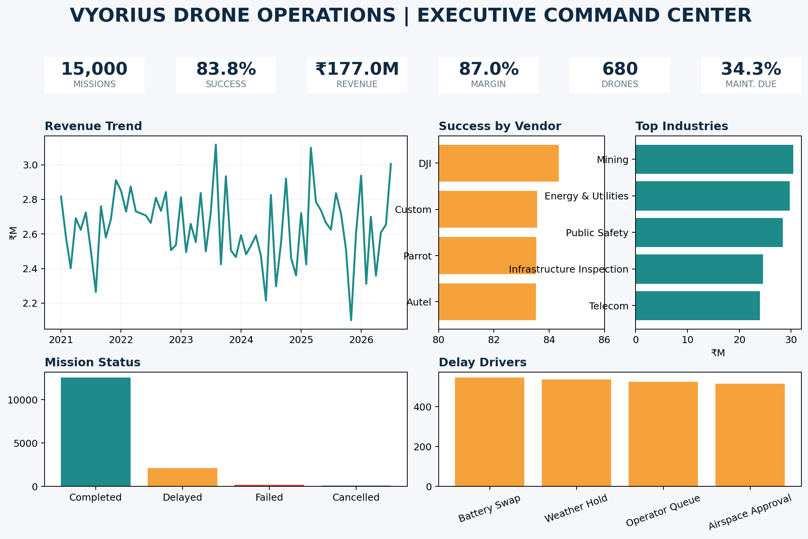

<div align="center">

# 🚁 Vyorius Drone Operations Analytics
### SQL • Python EDA • Power BI • AI Decision Support

**15,000 missions | 62 fields | 680 drones | 450 customers | 2021–2026**


</div>

## Project Overview
This portfolio project analyzes a synthetic drone-operations dataset modeled around enterprise fleet operations. It combines **SQL business analysis, Python EDA, Power BI dashboard design, KPI reporting, root-cause analysis and AI-assisted decision support**.

### Business questions solved
1. How reliable is the fleet, and which manufacturers/models perform best?
2. What causes failed and delayed missions?
3. Which drones create the highest maintenance burden and downtime?
4. Which industries, mission types and plans generate the strongest revenue/margin?
5. Where is fleet capacity underused or overburdened?
6. How can AI support maintenance prioritization and mission scheduling?
7. How can multi-vendor telemetry be standardized for DJI, Autel, Parrot, PX4 and ArduPilot?

## Executive Results
| KPI | Result |
|---|---:|
| Total missions | 15,000 |
| Mission success rate | 83.77% |
| Delay rate | 14.13% |
| Failure rate | 1.43% |
| Unique drones | 680 |
| Unique customers | 450 |
| Revenue | ₹176.97M |
| Gross margin | ₹154.00M |
| Gross margin % | 87.02% |
| Avg battery health | 89.59% |
| Maintenance due rate | 34.32% |


## Key Insights
- **GPS degradation** is the largest failed-mission reason in the dataset; **high wind** is the next major failure driver.
- Delays are dominated by **battery swaps, weather holds, operator queues and airspace approvals**.
- **DJI** shows the highest mission success rate among the manufacturer groups in this dataset.
- **Logistics** has the lowest observed success rate among industries and also the weakest gross-margin percentage of the industry groups.
- Predictive-maintenance modeling can use battery health, charge cycles and days since service to flag service risk before mission assignment.
- Fleet optimization is handled with a drone-level score balancing mission volume, success, battery health, gross margin, downtime and maintenance cost.

## Dashboard Preview



## AI / ML: What Was Actually Done
### 1. Predictive Maintenance
A Random Forest classifier predicts whether a drone record is **maintenance due** using only pre-maintenance features such as:
- battery health
- charge cycles
- days since last service
- manufacturer/model/platform
- mission distance/duration
- payload utilization

Holdout POC performance on this dataset:
- **ROC-AUC: 0.987**
- **Accuracy: 0.990**

### 2. AI-Assisted Mission Scheduling
Instead of claiming an autonomous scheduler, the project builds a **risk-scoring layer**. Each candidate mission gets a pre-flight risk score from:
- wind
- signal strength
- GPS accuracy
- battery health/start level
- payload utilization
- maintenance status
- days since service

Recommendations:
- **Schedule first** — low operational risk
- **Review conditions** — moderate risk
- **Defer / reassign** — high risk

This converts raw telemetry into a planner-friendly queue.

### 3. Fleet Optimization
A drone-level optimization score combines:
- utilization / mission count
- mission success
- battery health
- gross margin
- downtime
- maintenance cost

The score helps identify aircraft that should receive more missions versus aircraft that should be serviced or relieved.

### 4. Multi-Vendor Interoperability
DJI, Autel, Parrot, PX4 and ArduPilot records are normalized into one shared schema. The analysis compares common fields rather than vendor-specific labels, enabling one KPI layer for a mixed fleet.

### 5. Autonomous Mission Planning Roadmap
A practical roadmap is:
**historical analytics → risk prediction → human-approved recommendations → route/slot optimization → controlled autonomous planning**.

## Repository Structure
```text
Vyorius_Drone_Operations_Analytics/
├── data/
│   ├── raw/                       # Original CSV
│   └── processed/                 # KPI, trends, fleet scores, AI outputs
├── sql/
│   └── vyorius_business_queries.sql
├── sql_outputs/                   # Saved KPI/query-result tables
├── python/
│   ├── eda_analysis.py
│   └── ai_decision_support.py
├── notebooks/
│   └── vyorius_eda_business_analysis.ipynb
├── dashboard/
│   ├── powerbi_measures.dax
│   ├── powerbi_build_guide.md
│   └── interactive_dashboard.html
├── images/
├── docs/
│   └── Vyorius_Drone_Operations_Project_Report.docx
├── requirements.txt
└── README.md
```

## SQL Coverage
The SQL file contains **25 business queries** covering:
- executive KPIs
- data quality
- monthly and YoY revenue
- manufacturer/model reliability
- failure and delay root causes
- weather/wind/battery risk
- maintenance burden
- fleet utilization
- industry and plan economics
- retention proxy
- customer segmentation
- operator performance
- RTK effectiveness
- payload utilization
- mission profitability
- geographic opportunity
- rolling revenue
- management exception lists

## Python EDA
Run:
```bash
pip install -r requirements.txt
python python/eda_analysis.py
python python/ai_decision_support.py
```

Or open:
```text
notebooks/vyorius_eda_business_analysis.ipynb
```

## Power BI Steps
1. Open Power BI Desktop → **Get Data → Text/CSV**.
2. Load `data/raw/vyorius_drone_operations_synthetic_2021_2026.csv`.
3. In Power Query, set `mission_date` as Date and numeric KPI fields as Decimal/Whole Number.
4. Create the Date table shown in `dashboard/powerbi_build_guide.md`.
5. Create a one-to-many Date relationship.
6. Paste measures from `dashboard/powerbi_measures.dax`.
7. Build the five report pages from the guide.
8. Create a report-page tooltip for richer hover details.
9. Add slicers for year, manufacturer, model, industry, plan and mission type.
10. Publish a screenshot/GIF to the README. If the data is safe to share, publish to Power BI Service and add the public portfolio link.

## How to Upload This Project to GitHub
### A. Create the repository
1. GitHub → **New repository**.
2. Repository name: `vyorius-drone-operations-analytics`
3. Description: `End-to-end SQL, Python, Power BI and AI decision-support analysis of 15K+ drone missions.`
4. Choose **Public** if the dataset is safe to share; otherwise keep data private/remove `data/raw`.
5. Do **not** add another README if using this package.

### B. Upload through GitHub website
1. Open the new repository.
2. **Add file → Upload files**.
3. Drag the **contents** of this project folder, preserving folders.
4. Commit message: `Initial end-to-end analytics project`
5. Click **Commit changes**.

### C. Recommended Git workflow
```bash
git init
git add .
git commit -m "Initial end-to-end analytics project"
git branch -M main
git remote add origin https://github.com/YOUR_USERNAME/vyorius-drone-operations-analytics.git
git push -u origin main
```


## Tech Stack
**SQL:** MySQL 8.0  
**Python:** Pandas, NumPy, Matplotlib, Plotly, Scikit-learn  
**BI:** Power BI, DAX, Power Query  
**Concepts:** KPI design, EDA, RCA, customer/financial analytics, fleet optimization, predictive maintenance, AI-assisted scheduling

---
*Portfolio project based on a synthetic dataset. Validate all operational/financial assumptions before using in a real flight operation.*
